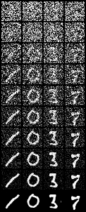
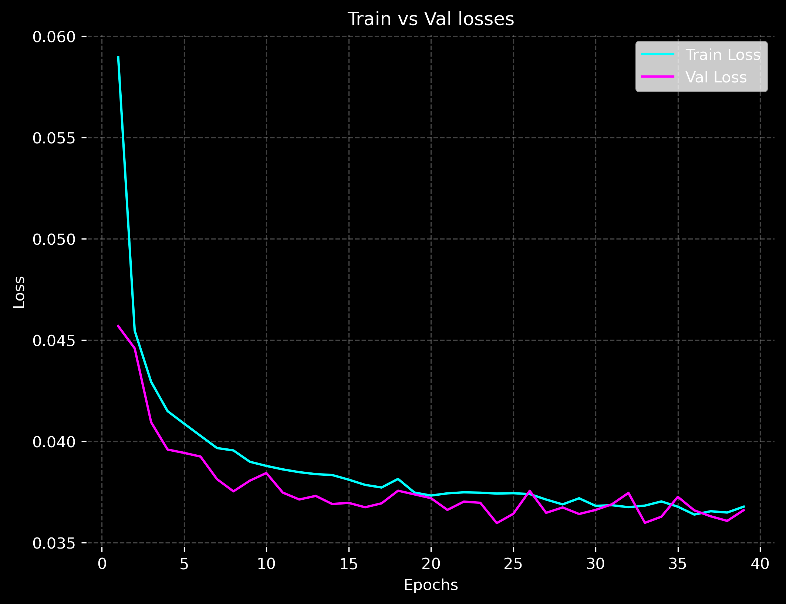
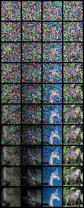
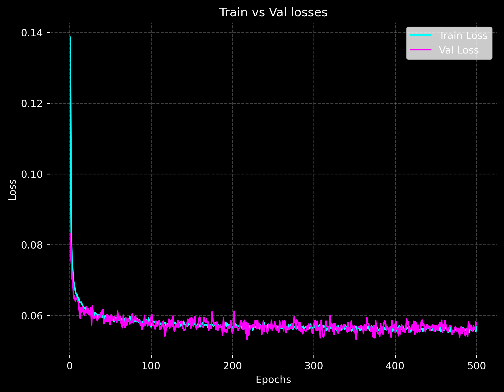

## Introduction to Denoising Diffusion Probabilistic Models

Denoising Diffusion Probabilistic Models (DDPMs) represent a class of generative models designed to synthesize complex data distributions, such as images or audio, by iteratively reversing a stochastic diffusion process. Introduced by Ho et al. (2020), DDPMs are inspired by principles from non-equilibrium thermodynamics, where the forward process mimics the gradual diffusion of a substance, such as ink in water, toward an equilibrium state of pure noise.

---
## Core Concepts

The DDPM framework comprises two primary processes: the forward diffusion process, which corrupts data with noise, and the reverse denoising process, which learns to reconstruct the original data.
### **Forward Process (Diffusion)**
The forward process systematically adds Gaussian noise to an input data sample $x_0$ over T timesteps, transforming it into pure noise. This Markov chain is defined as:

$$
q(x_t \mid x_{t-1}) = \mathcal{N}\!\left(x_t;\ \sqrt{1 - \beta_t}\, x_{t-1},\ \beta_t I \right)
$$

where:
- $\beta_t \in (0, 1)$ is a small variance term (the **noise schedule**),
- $\sqrt{1 - \beta_t}$ scales the signal,
- and $\beta_t I$ is the added Gaussian noise covariance.

A key insight in DDPMs is that we can **directly sample a noisy version of an image at any timestep t** without iteratively applying noise at each intermediate step. This is done using the **cumulative product of signal retention terms**:

$$
x_t = \sqrt{\bar{\alpha}_t}\, x_0 + \sqrt{1 - \bar{\alpha}_t}\, \epsilon,
\quad \epsilon \sim \mathcal{N}(0, I) \quad \bar{\alpha}_t = \prod_{s=1}^t ( 1-\beta_s)
$$

Here:

- $\bar{\alpha}_t$ represents how much of the original signal remains at timestep t,
- $\epsilon$ is standard Gaussian noise.

This formulation is implemented in two stages: generating the noise schedule and applying noise to the input.
####  Generating the Noise Schedule

```python
def get_beta_schedule(T, beta_start=1e-4, beta_end=0.02, s=0.008, schedule_type="linear", device="cpu"):

	if schedule_type == "linear":
		beta_t = torch.linspace(beta_start, beta_end, T)
		alphas = 1 - beta_t
		alpha_cumprod = torch.cumprod(alphas, dim=0)
		return beta_t.to(device), alpha_cumprod.to(device)
	
	elif schedule_type == "cosine":	
		t = torch.linspace(0, T, T+1, dtype=torch.float32) / T		
		f_t = torch.cos((t + s) / (1 + s) * (math.pi / 2)) ** 2		
		alpha_cumprod = f_t / f_t[0] # Normalize so α̅₀ = 1
		# Compute stepwise alphas and betas
		alphas = alpha_cumprod[1:] / alpha_cumprod[:-1]
		beta_t = 1 - alphas
		alpha_cumprod = alpha_cumprod[1:]
		beta_t = torch.clamp(beta_t, max=0.999)
		return beta_t.to(device), alpha_cumprod.to(device)
```
#### Applying Noise to the Image

```python
def add_noise(x0, t, alpha_cumprod):
	epsilon = torch.randn_like(x0)
	# Gather α̅_t for each example in the batch
	alpha_cumprod_t = alpha_cumprod[t].view(-1, 1, 1, 1)
	# Compute noisy sample
	sqrt_alpha_cumprod = torch.sqrt(alpha_cumprod_t)
	sqrt_one_minus_alpha_cumprod = torch.sqrt(1 - alpha_cumprod_t)
	xt = sqrt_alpha_cumprod * x0 + sqrt_one_minus_alpha_cumprod * epsilon
	return xt, epsilon
```

### Reverse Process (Denoising) 

The reverse process learns to denoise $\large x_t$​ back to  $\large x_0$​ using a parameterized neural network, typically a U-Net. The model approximates the posterior:

$$
p_\theta(x_{t-1} | x_t) = \mathcal{N}\left(x_{t-1}; \mu_\theta(x_t, t), \Sigma_\theta(x_t, t)\right)
$$

where:
- $\mu_\theta(x_t, t)$ is the predicted mean (a function of the noisy image $\large x_t$ and the timestep t),
- $\Sigma_\theta(x_t, t)$ is the predicted variance,
- $\theta$ represents the network parameters.

For stability, the network predicts the noise $\large \epsilon$ rather than $\large x_{t-1}$ directly.

```python 
def p_sample(model, x_t, t, beta_t, alpha_cumprod):
	eps_theta = model(x_t, t) # predict the noise ε_θ(x_t, t)
	beta_t = beta_t[t].view(-1, 1, 1, 1)
	alpha_t = 1 - beta_t
	alpha_cumprod_t = alpha_cumprod[t].view(-1, 1, 1, 1)
	mu_theta = (
	1 / torch.sqrt(alpha_t)
	) * (x_t - (beta_t / torch.sqrt(1 - alpha_cumprod_t)) * eps_theta)
	
	noise = torch.randn_like(x_t) if t[0] > 0 else 0
	x_prev = mu_theta + torch.sqrt(beta_t) * noise
	return x_prev
```

---
## Learning Objective

The model is optimized by minimizing the simplified variational lower bound, equivalent to the mean squared error between the true noise $\large \epsilon$ and the predicted noise $\large \epsilon_\theta(x_t, t)$)

$$
L_{\text{simple}} = \mathbb{E}_{x_0, t, \epsilon} \left[ \| \epsilon - \epsilon_\theta(\sqrt{\bar{\alpha}_t} x_0 + \sqrt{1 - \bar{\alpha}_t} \epsilon, t) \|^2 \right]
$$

Here:
- $\epsilon$ is the true Gaussian noise used to generate $\large x_t$​,
- $\epsilon_\theta(\cdot)$ is the model’s predicted noise.

In practice:
```python
xt, noise = add_noise(x0, t, alpha_cumprod)
predicted_noise = model(xt, t)
loss = torch.nn.functional.mse_loss(predicted_noise, noise)
```

---
##  **Sampling (Image Generation)**

After training, new images can be generated by **iteratively applying the learned denoising steps**:
1. Start from Gaussian noise: $\large x_T \sim \mathcal{N}(0, I)$
2. For $t = T, T-1, \dots, 1$:
    - Predict noise: $\large \hat{\epsilon}_\theta = \epsilon_\theta(x_t, t)$
    - Compute mean:

$$
       \mu_\theta(x_t, t) = \frac{1}{\sqrt{\alpha_t}} \left(x_t - \frac{\beta_t}{\sqrt{1 - \bar{\alpha}_t}} \hat{\epsilon}_\theta \right)
$$
      
	-  Sample:

$$
     x_{t-1} = \mu_\theta(x_t, t) + \sigma_t z, \quad z \sim \mathcal{N}(0, I)
$$

After all steps, $x_0$​ is a generated sample.

```python
def generate_image(model, shape, T, beta_t, alpha_cumprod, device="cpu"):
	x = torch.randn(shape, device=device) # start from pure noise
	for t in reversed(range(T)):
	t_batch = torch.tensor([t] * shape[0], device=device)
	x = p_sample(model, x, t_batch, beta_t, alpha_cumprod)
	return x
```

---

## Design and Implementation 

This section outlines the design choices and implementation details of the DDPM model, focusing on the U-Net architecture, temporal embeddings, and training optimizations used to handle limited hardware resources.

The implementation follows the standard **U-Net architecture**, combining **spatial feature extraction** with **temporal conditioning** through sinusoidal time embeddings. The model uses an **encoder–decoder** structure connected by skip links to preserve fine-grained spatial information. Each **Residual Block** incorporates the time embedding via a learned scale-and-shift modulation, enabling the network to adjust its denoising behavior based on the current noise level. The encoder progressively captures hierarchical features through downsampling, while the decoder reconstructs image details during upsampling.

### Sinusoidal Position Embeddings
In a **Denoising Diffusion Probabilistic Model (DDPM)**, the model must condition its predictions on the **current diffusion timestep** t, since the amount of noise in the input varies throughout the process. However, neural networks, especially convolutional architectures like U-Nets, cannot inherently understand scalar values like t. The **SinusoidalPosEmb** module converts this scalar timestep into a **high-dimensional vector representation** that captures meaningful periodic structure, making it easier for the network to learn time-dependent behavior.

The embedding uses a set of sine and cosine functions with exponentially increasing frequencies, similar to the positional encodings introduced in the **Transformer** architecture. Formally, for a timestep t, the embedding is defined as:

$$
\text{emb}(t) = [\sin(t \cdot \omega_1), \cos(t \cdot \omega_1), \ldots, \sin(t \cdot \omega_k), \cos(t \cdot \omega_k)]
$$

where the frequencies $\large \omega_i$ are logarithmically spaced.

In code this looks like:
```python
class SinusoidalPosEmb(nn.Module):
	def __init__(self, dim):
		super().__init__()
		self.dim = dim
	
	def forward(self, t):
		device = t.device
		half_dim = self.dim // 2
		emb = math.log(10000) / (half_dim - 1)
		emb = torch.exp(torch.arange(half_dim, device=device) * -emb)
		emb = t[:, None] * emb[None, :]
		emb = torch.cat([torch.sin(emb), torch.cos(emb)], dim=-1)
		return emb # (B, dim)
```

### Gradient Accumulation

To overcome GPU memory constraints, **gradient accumulation** was used to simulate larger batch sizes by delaying weight updates:

```python
# Gradient Accumulation
for i, (x0, _) in enumerate(train_loader):
	x0 = x0.to(device, non_blocking=True)
	alpha_cumprod = alpha_cumprod.to(x0.device)
	beta_t = beta_t.to(x0.device)
	t = torch.randint(0, T, (x0.size(0),), device=device)
	xt, noise = add_noise(x0, t, alpha_cumprod)
	
	predicted_noise = model(xt, t)
	loss = torch.nn.functional.mse_loss(predicted_noise, noise)
	
	# Scale loss so total gradient magnitude stays correct
	loss = loss / accum_steps
	loss.backward()
	
	if (i + 1) % accum_steps == 0 or (i + 1) == len(train_loader):
		optimizer.step()
		optimizer.zero_grad()
```


### Mixed Precision

**Mixed precision training** was also used to reduce memory footprint and accelerate computation by combining 16-bit (FP16) and 32-bit (FP32) operations:

```python
scaler = torch.cuda.amp.GradScaler()
for i, (x0, _) in enumerate(train_loader):
    with torch.cuda.amp.autocast():
        xt, noise = add_noise(x0, t, alpha_cumprod)
        predicted_noise = model(xt, t)
        loss = torch.nn.functional.mse_loss(predicted_noise, noise) / accum_steps
    scaler.scale(loss).backward()
    if (i + 1) % accum_steps == 0:
        scaler.step(optimizer)
        scaler.update()
        optimizer.zero_grad()

```


## Experiments and results 

### Training Setup
Models were trained on **MNIST** and **CIFAR-10** with **1,000 diffusion steps (T = 1000)** using the **Adam** optimizer, gradient accumulation, and mixed precision.

### Hyperparameters:
```json
{
  "batch_size": 2,
  "accum_steps": 64,
  "img_size": 32,
  "base_ch": 128,
  "time_emb_dim": 256,
  "lr": 0.0001,
  "weight_decay": 0.0,
  "epochs": 500,
  "T": 1000,
  "beta_start": 0.0001,
  "beta_end": 0.02,
  "s": 0.008,
  "schedule_type": "cosine"
}
```
Note: Effective batch size = batch_size × accum_steps = 128.
#### Hardware
Training was conducted on a **NVIDIA RTX 3060 GPU (8 GB VRAM)** with a **Ryzen 7 CPU** and **32 GB RAM**. Memory optimization techniques enabled stable training despite limited resources.

#### MNIST dataset


*Reverse diffusion from noise to digits*



*Training and validation loss curves. on the MINST dataset*


|Metric|Mean|Min|Max|Final|
|---|---|---|---|---|
|**Train Loss**|0.0387|0.0364|0.0590|0.0368|
|**Val Loss**|0.0377|0.0360|0.0457|0.0366|

##### Observations
- Training and validation losses remain closely aligned, indicating minimal overfitting.
- Losses stabilize around 0.036–0.038 after ~40 epochs, demonstrating efficient convergence.
- The model successfully reconstructs digits from noise, confirming that it has learned the reverse diffusion process.

#### CIFAR-10



*Reverse diffusion from noise to RGB images*



*Training and validation loss curves. on CIFAR-10*

| Metric         | Mean   | Min    | Max    | Final  |
| -------------- | ------ | ------ | ------ | ------ |
| **Train Loss** | 0.0576 | 0.0551 | 0.1386 | 0.0567 |
| **Val Loss**   | 0.0575 | 0.0532 | 0.0832 | 0.0574 |

##### Observations
- Loss curves remain closely aligned, indicating strong generalization.
- The model converges around 0.056–0.058 loss values after ~50 epochs.
- Generated samples exhibit recognizable color and shape structure, showing scalability from MNIST to CIFAR-10 despite limited resources.

## Challenges and Solutions
The primary challenge was **GPU memory management**. Training high-resolution diffusion models required substantial memory, limiting feasible batch sizes and training speed. **Gradient accumulation** and **mixed precision training** mitigated these issues effectively for MNIST, though CIFAR-10 remained resource-intensive.

Another challenge involved **evaluating perceptual quality**. While loss convergence indicated stable training, it did not always correspond to visually coherent outputs. Future work may explore **perceptual metrics**, **FID scores**, and **improved sampling strategies** to better quantify generative performance.

---

For more information on [DDPM](posts/ddpm/index.md)